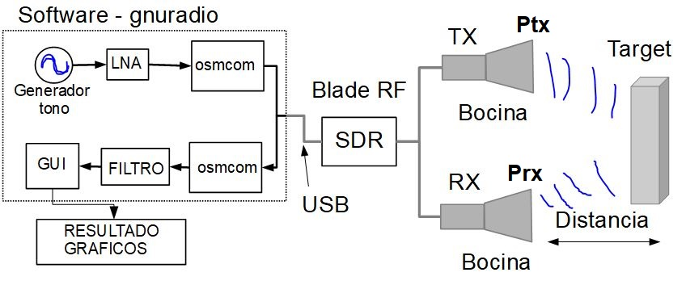
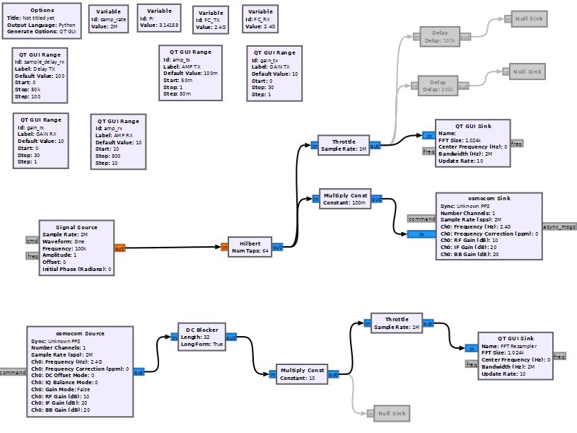
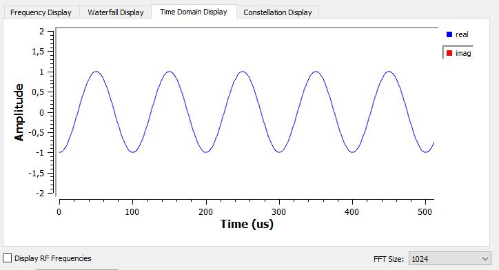
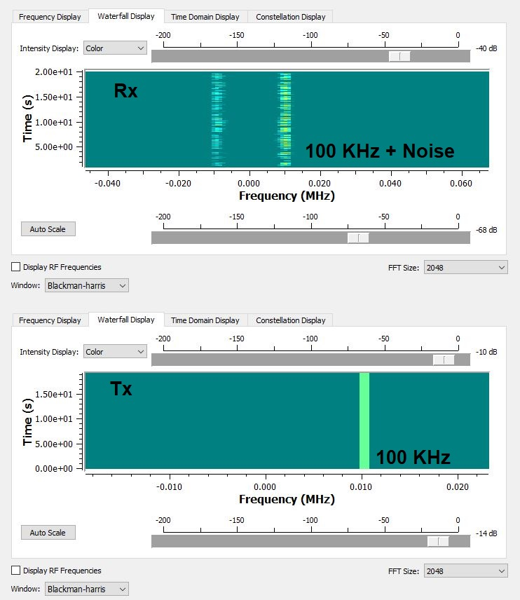
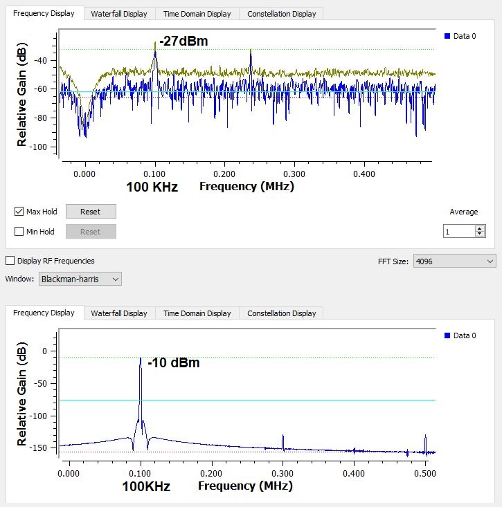
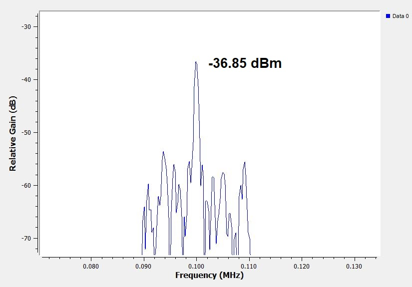
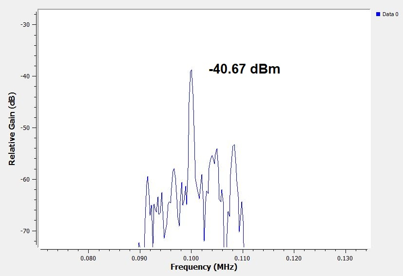
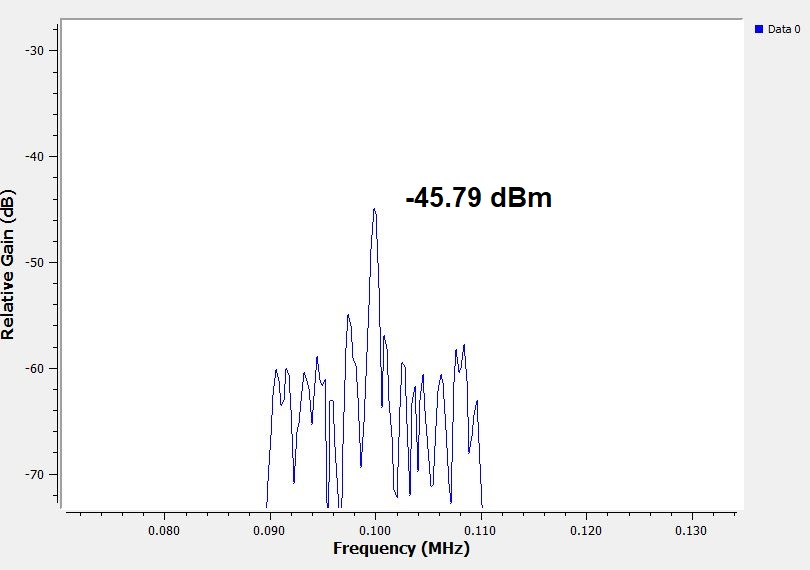

### Transmision y recepcion de un tono con  SDR BladeRF v2

### Diagrama en modulos con gnuradio

### señal (tone) trasnmitida 

### Spectrograma

### FFT

### Mediciones con un plato de metal de 40 cm de lado

- Resultados a 60 cm 

- Resultados a 90 cm 

- Resultados a 120 cm 

- Resultados a 150 cm 

### Tabla de resutados :
-----------------------

|  Distancia  [cm]  | Potencia [dBm]   |
| :---------------- | :--------------: | 
|        60         |     -28.22       | 
|        90         |     -36.85       | 
|       120         |     -40.67       | 
|       150         |     -45.79       | 

